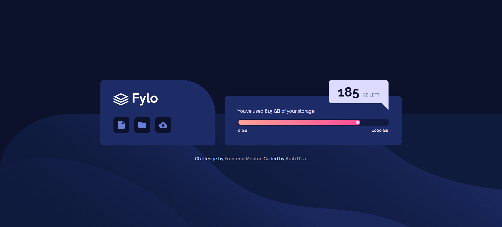
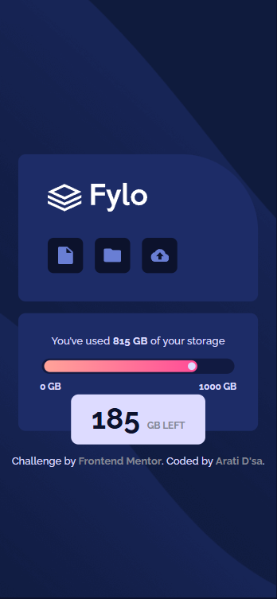

<p align="center">
  
</p>
<h1 align="center">
  🌟 Fylo Data Storage Component
</h1>

<p align="center">A responsive solution to the Fylo Data Storage Component challenge on Frontend Mentor.</p>


<h3 align="center">
  🌐 <a href="https://codecove01-netizen.github.io/Fylo-Data-Storage-Component-Frontend-Mentor/">Live Demo</a>
  &nbsp;|&nbsp;
  📂 <a href="https://github.com/codecove01-netizen/Fylo-Data-Storage-Component-Frontend-Mentor">Source Code</a>
  &nbsp;|&nbsp;
  🎯 <a href="https://www.frontendmentor.io/challenges/fylo-data-storage-component-1dZPRbV5n">Challenge</a>
</h3>

<br/>
<p align="center">
  
  &nbsp;&nbsp;
  
  &nbsp;&nbsp;
  
</p>


<h1 align="left">
  📸 Layout Overview
</h1>

<h3 align="center">💻 Desktop View</h3>

<p align="center">
  
</p>

<br>

<h3 align="center">📱 Mobile View</h3>

<p align="center">
  
</p>

---
## 🚀 Built With

<p>
  
  
  
  
</p>

- Semantic HTML5 markup for clear document structure and accessibility
- CSS Custom Properties for maintainable design tokens and consistent styling
- Flexbox for responsive layout and component alignment
- Mobile-first workflow with a desktop enhancement media query
- Accessible progress bar implementation using ARIA roles and values
- CSS pseudo-elements (`::after`) for recreating the desktop storage tooltip
- Responsive background images tailored for mobile and desktop viewports
- Absolute positioning combined with relative containers for precise UI placement
- Modern CSS techniques for spacing, sizing, and responsive design
- Responsive images using `max-width: 100%` to prevent overflow

---

<h2 align="left">🛠️ Tools Used</h2>

<p align="left">
  
  
  
  
</p>

---
## 💡 What I Learned

- Improved my understanding of the mobile-first workflow by building the layout for smaller screens first and progressively enhancing it for desktop devices.
- Learned how to position elements relative to their parent containers instead of relying on fixed viewport values, resulting in a more stable and responsive layout.
- Practiced creating a custom storage progress bar using gradients, border-radius, and nested elements.
- Used relative and absolute positioning to keep the storage indicator aligned with the end of the progress fill regardless of screen size.

```css
.storage-fill {
  width: 81.5%;
  position: relative;
}

.storage-dot {
  position: absolute;
  right: 0.15rem;
  top: 50%;
  transform: translateY(-50%);
}
```

- Learned how to create a tooltip pointer using a CSS pseudo-element and the border-triangle technique.

```css
.data-remained::after {
  content: "";
  position: absolute;
  bottom: -1.25rem;
  right: 0;
  width: 0;
  height: 0;
  border-left: 1.25rem solid transparent;
  border-top: 1.25rem solid var(--blue-200);
}
```

- Gained experience positioning floating UI elements relative to their containers, ensuring the desktop tooltip remained correctly attached to the storage card during viewport resizing.
- Improved my understanding of responsive background images by switching between mobile and desktop assets using media queries.
- Practiced implementing accessibility improvements by adding ARIA attributes to the progress bar and using empty `alt` attributes for decorative images.
- Reinforced the use of CSS Custom Properties to maintain a consistent color palette and simplify future design updates.
- Improved my ability to recreate a design from a static mockup while maintaining responsiveness and accessibility across different screen sizes.

## Continued development

In future projects, I would like to explore more robust positioning techniques for floating UI elements and continue improving accessibility by providing more descriptive ARIA labels and testing with assistive technologies.

---

## 🎯 The Challenge

- Build out this Fylo Data Storage Component and get it looking as close to the design as possible.
- Users should be able to:
  1. View the optimal layout depending on their device's screen size
- Try estimating the time it will take for you to build the project. 

## ⏱️ Time Estimation

- Initial HTML structure: ~45 minutes
- Mobile layout styling: ~2 hours
- Desktop layout implementation: ~1.5 hours
- Debugging and responsive adjustments: ~2 hours
- Accessibility improvements and semantic HTML review: ~30 minutes
- README documentation and project screenshots: ~30 minutes

**Total estimated time:** ~7 hours 15 minutes
---
<h2 align="left">🌐 Connect With Me</h2>

<p align="left">
  <a href="https://github.com/codecove01-netizen">
    
  </a>
&nbsp;&nbsp;
  <a href="https://www.linkedin.com/in/arati-dsa-313626136/">
    
  </a>
&nbsp;&nbsp;
  <a href="https://www.frontendmentor.io/profile/codecove01-netizen">
    
  </a>
</p>

---

## 🙏 Acknowledgments

Thanks to **Frontend Mentor** for providing practical challenges that help developers strengthen their frontend skills through hands-on learning.
